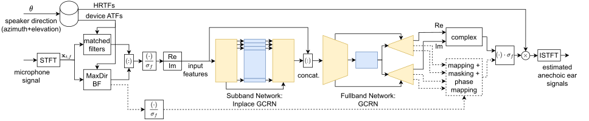

# Multichannel Subband-Fullband Gated Convolutional Recurrent Neural Network For Direction-Based Speech Enhancement With Head-Mounted Microphone Arrays

This repository contains the code for reproducing the results shown in the paper "Multichannel Subband-Fullband Gated Convolutional Recurrent Neural Network For Direction-Based Speech Enhancement With Head-Mounted Microphone Arrays".  

[WASPAA Paper](https://doi.org/10.1109/WASPAA58266.2023.10248181)

[Demo](https://mc-directional-hma-speech-enhancement.iem.sh)

## Note
The code in the `spear-tools` submodule is subject to its own licenses. If not licensed, all rights remain with the original author (Imperial College London).

The `FullSubNet` sub-repository also is third-party code and has separate licensing.

## Installation
First `cd` into `./spear-tools` and set up the SPEAR paths and symbolic links and the conda environment according to `spear-tools/README.md`.

A block diagram of the approach is shown in the following figure:

  

Model checkpoints are available [here](https://drive.google.com/file/d/107Yryam40MQQ2yndP_LXVAC_NFqfPC6X/view?usp=sharing).

### Instructions
The following instructions assume you have downloaded the datasets and configured the paths as described in the sections above.

To run the models, you will need the packages defined in `requirements.txt`. Install them into your environment `<your-env-name>` using `pip install -r requirements.txt`.

For inference with the `MaxDirAndFullsubnet` method, you need to download the FullSubNet checkpoint model weights [here](https://github.com/Audio-WestlakeU/FullSubNet/releases/download/v0.2/fullsubnet_best_model_58epochs.tar) into `./FullSubNet`.

Please adjust paths and other variables in the scripts `train.py`, `validate.py`, `process`, `validate_baseline_unprocessed.py`, `view_metrics.py` and in the config files as you need.

## Author
This repository is authored by Benjamin Stahl and was created at the Intitute of Elctronic Music and Acoustics in Graz, Austria in 2022/23.